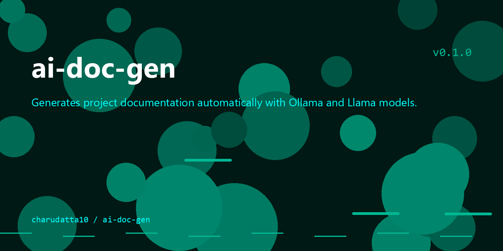

# ai-doc-gen

<p align="center">
  
</p>


<!-- Badges: Project Status GitHub -->


[](https://github.com/sponsors/charudatta10)
[](https://charudatta10.github.io/LinkNet/)
[](https://charudatta10.github.io/myblog/)


 
 


<!-- Badges: Tools used -->
`python` `ollama` `llama`

## What is this?

ai-doc-gen uses AI models such as Ollama and Llama to generate project documentation automatically. It inspects a codebase and produces structured documentation for it. Run it with invoke and the generated docs are written into the docs folder.   

## Features

- ai documentation
- easy to use

## Getting Started

1. Clone the repository:

```bash
   git clone https://github.com/charudatta10/ai-doc-gen.git
```

1. Navigate to the project directory:

```bash
cd ai-doc-gen
```

1. Run the project:

```bash
invoke
```

## Contributing

Contributions are welcome! Please open an issue or submit a pull request for any bugs or feature requests. [Report a bug or Request a feature](https://github.com/charudatta10/ai-doc-gen/issues)

## License

This project is licensed under the terms in [LICENSE.md](LICENSE.md).

## COPYRIGHT NOTICE

© 2025 Charudatta Korde. Some Rights Reserved. Attribution Required. Non-Commercial Use & Share-Alike. For complete details, refer to the accompanying License Agreement.

<!-- Acknowledgment, References, Misc -->